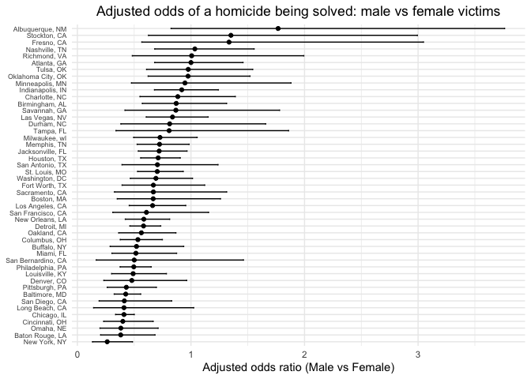
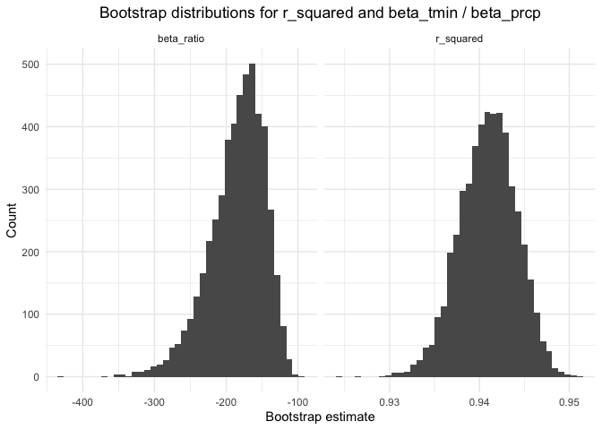

p8105_hw6_xy2719
================
Yao
2025-12-02

Load key packages.

``` r
library(tidyverse)
library(modelr)
library(p8105.datasets)
```

## Problem 1

Load data file.

``` r
homi_raw =
  readr::read_csv("data/homicide-data.csv")
```

    ## Rows: 52179 Columns: 12
    ## ── Column specification ────────────────────────────────────────────────────────
    ## Delimiter: ","
    ## chr (9): uid, victim_last, victim_first, victim_race, victim_age, victim_sex...
    ## dbl (3): reported_date, lat, lon
    ## 
    ## ℹ Use `spec()` to retrieve the full column specification for this data.
    ## ℹ Specify the column types or set `show_col_types = FALSE` to quiet this message.

Clean data.

``` r
# Create a city_state variable and a binary variable. Omit cities don't report victim race.
homi_df =
  homi_raw |>
  mutate(
    city_state = str_c(city, ", ", state),
    resolved = if_else(disposition == "Closed by arrest", 1, 0),
    victim_age = as.numeric(victim_age)
  ) |>
  filter(
    !city_state %in% c("Dallas, TX",
                       "Phoenix, AZ",
                       "Kansas City, MO",
                       "Tulsa, AL"),
    victim_race %in% c("White", "Black"),
    !is.na(victim_age),
    victim_sex %in% c("Male", "Female")
  ) |>
  mutate(
    victim_sex  = forcats::fct_relevel(victim_sex,  "Female"),
    victim_race = forcats::fct_relevel(victim_race, "White")
  )
```

Fit a logistic regression to Baltimore, MD.

``` r
baltimore_df = 
  homi_df |>
  filter(city_state == "Baltimore, MD")

baltimore_glm = 
  glm(
    resolved ~ victim_age + victim_sex + victim_race,
    data   = baltimore_df,
    family = binomial()
  )

baltimore_or = 
  baltimore_glm |>
  broom::tidy(exponentiate = TRUE, conf.int = TRUE) |>
  filter(term == "victim_sexMale") |>
  select(term, estimate, conf.low, conf.high)

baltimore_or
```

    ## # A tibble: 1 × 4
    ##   term           estimate conf.low conf.high
    ##   <chr>             <dbl>    <dbl>     <dbl>
    ## 1 victim_sexMale    0.426    0.324     0.558

Run glm for each of the cities.

``` r
# Create logistic model function
log_reg = function(df) {
  glm(
    resolved ~ victim_age + victim_sex + victim_race,
    data   = df,
    family = binomial()
  )
}

# Fit function to each of the cities
city_or = 
  homi_df |>
  group_by(city_state) |>
  nest() |>
  mutate(
    fit = map(data, log_reg),
    tidy_fit = purrr::map(
      fit, 
      ~ broom::tidy(.x, exponentiate = TRUE, conf.int = TRUE)
    )
  ) |>
  select(city_state, tidy_fit) |>
  unnest(tidy_fit) |>
  filter(term == "victim_sexMale") |>
  ungroup() |>
  mutate(
    city_state = forcats::fct_reorder(city_state, estimate)
  )

# Dataframe with estimated ORs and CIs for each city
city_or_df =
  city_or |> 
  select(city_state, estimate, conf.low, conf.high) |> 
  arrange(estimate)

city_or_df
```

    ## # A tibble: 47 × 4
    ##    city_state      estimate conf.low conf.high
    ##    <fct>              <dbl>    <dbl>     <dbl>
    ##  1 New York, NY       0.262    0.133     0.485
    ##  2 Baton Rouge, LA    0.381    0.204     0.684
    ##  3 Omaha, NE          0.382    0.199     0.711
    ##  4 Cincinnati, OH     0.400    0.231     0.667
    ##  5 Chicago, IL        0.410    0.336     0.501
    ##  6 Long Beach, CA     0.410    0.143     1.02 
    ##  7 San Diego, CA      0.413    0.191     0.830
    ##  8 Baltimore, MD      0.426    0.324     0.558
    ##  9 Pittsburgh, PA     0.431    0.263     0.696
    ## 10 Denver, CO         0.479    0.233     0.962
    ## # ℹ 37 more rows

Plot shows the estimated ORs and CIs for each city.

``` r
city_or_plot = 
  city_or |>
  ggplot(aes(x = city_state, y = estimate)) +
  geom_point(size = 1.5) +
  geom_errorbar(aes(ymin = conf.low, ymax = conf.high), width = 0.2) +
  coord_flip() +
  labs(
    x = NULL,
    y = "Adjusted odds ratio (Male vs Female)",
    title = "Adjusted odds of a homicide being solved: male vs female victims"
  ) +
  theme_minimal() +
  theme(
    plot.title = element_text(hjust = 0.5),
    axis.text.y  = element_text(size = 6.5)
    )

city_or_plot
```

<!-- -->

``` r
ggsave("figs/problem1.jpg", city_or_plot, width = 6.5, height = 5, dpi = 300)
```

Comments:

Cities are ordered from lowest to highest adjusted OR. Across the 47
cities, the adjusted odds ratios comparing male to female victims are
below 1 in most cities, meaning homicides with male victims have lower
odds of being solved than those with female victims after adjusting for
victim age and race. It indicates that homicides with male victims are
less likely to be solved than those with female victims. A few cities
have ORs near or above 1, but many of those have wide confidence
intervals that include 1, suggesting a lot of uncertainty.

## Problem 2

Load and clean data.

``` r
set.seed(1)

data("weather_df")

weather_df =
  weather_df |>
  drop_na(tmax, tmin, prcp)
```

Define a function.

``` r
boot_stats = function(df) {
  fit = lm(tmax ~ tmin + prcp, data = df)
  
  g = broom::glance(fit)
  t = broom::tidy(fit)
  
  beta_tmin = t |> 
    filter(term == "tmin") |> 
    pull(estimate)
  beta_prcp = t |> 
    filter(term == "prcp") |> 
    pull(estimate)
  
  tibble(
    r_squared  = g$r.squared,
    beta_ratio = beta_tmin / beta_prcp
  )
}
```

Use 5000 bootstrap samples.

``` r
boot_results =
  weather_df |>
  bootstrap(n = 5000) |>
  mutate(stats = map(strap, boot_stats)) |>
  unnest(stats)
```

Plot distribution of estimates.

``` r
boot_plot =
  boot_results |>
  pivot_longer(
    c(r_squared, beta_ratio),
    names_to = "parameter",
    values_to = "estimate"
  ) |>
  ggplot(aes(x = estimate)) +
  geom_histogram(bins = 40) +
  facet_wrap(~ parameter, scales = "free_x") +
  labs(
    x = "Bootstrap estimate",
    y = "Count",
    title = "Bootstrap distributions for r_squared and beta_tmin / beta_prcp"
  ) +
  theme_minimal() +
  theme(plot.title = element_text(hjust = 0.5))
    
boot_plot
```

<!-- -->

``` r
ggsave("figs/problem2.jpg", boot_plot, width = 5.5)
```

    ## Saving 5.5 x 5 in image

Description:

The bootstrap histograms show the sampling distributions of both
r_squared and the coefficient ratio beta_tmin / beta_prcp and based on
5000 resamples of the weather data.

The distribution of r_squared is tightly concentrated, indicating that
the linear model consistently explains a large proportion of the
variation in daily maximum temperature. The histogram is approximately
unimodal and narrow, suggesting that the estimate of model fit is very
stable across bootstrap samples.

In contrast, the distribution of the coefficient ratio beta_tmin /
beta_prcp is much more dispersed and shows greater variability. This
reflects the fact that the estimated effect of precipitation on maximum
temperature is small, leading to instability when dividing by a
coefficient close to zero. As a result, the ratio exhibits a wider and
more skewed distribution.

Identify the 2.5% and 97.5% quantiles.

``` r
boot_results |>
  summarise(
    r2_low     = quantile(r_squared, 0.025),
    r2_high    = quantile(r_squared, 0.975),
    ratio_low  = quantile(beta_ratio, 0.025),
    ratio_high = quantile(beta_ratio, 0.975)
  )
```

    ## # A tibble: 1 × 4
    ##   r2_low r2_high ratio_low ratio_high
    ##    <dbl>   <dbl>     <dbl>      <dbl>
    ## 1  0.934   0.947     -275.      -125.
